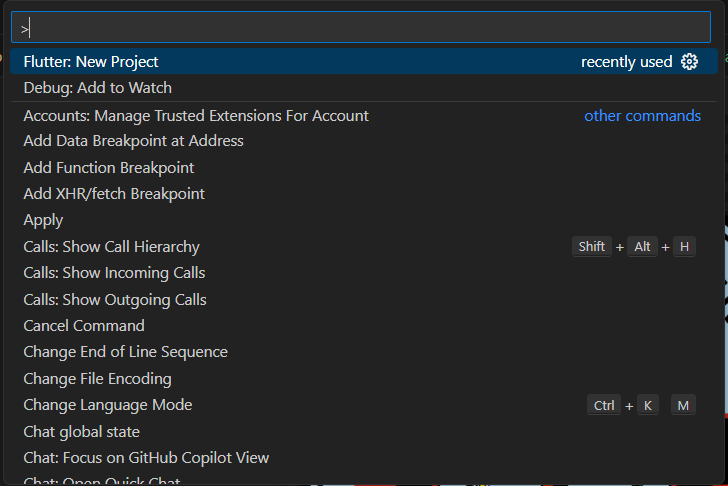
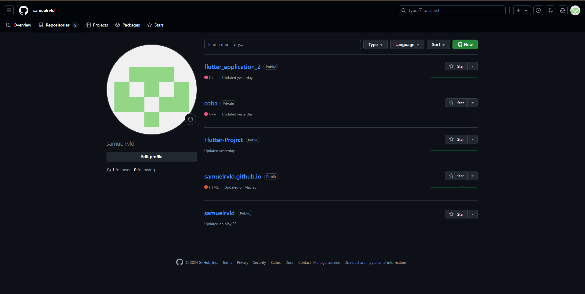
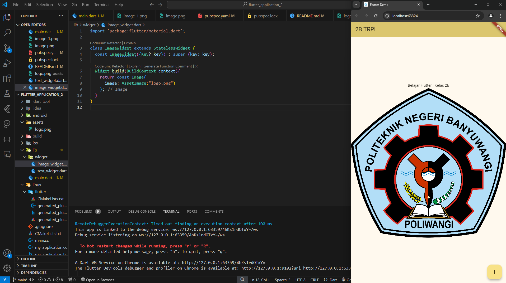
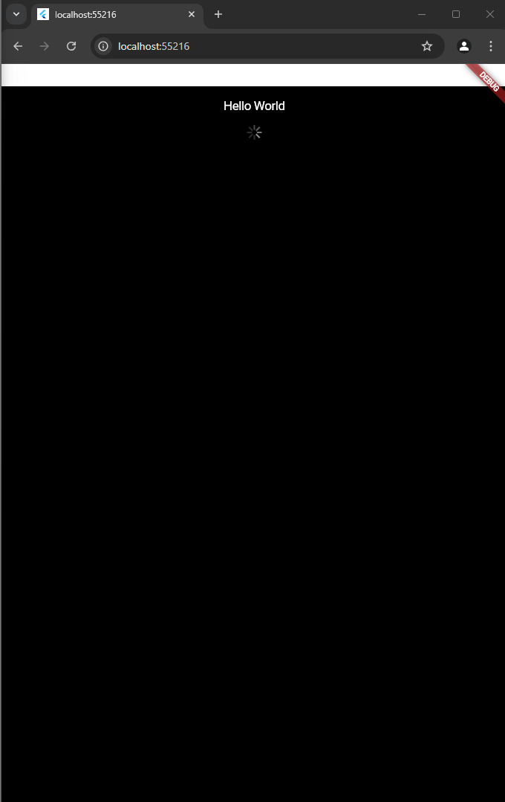
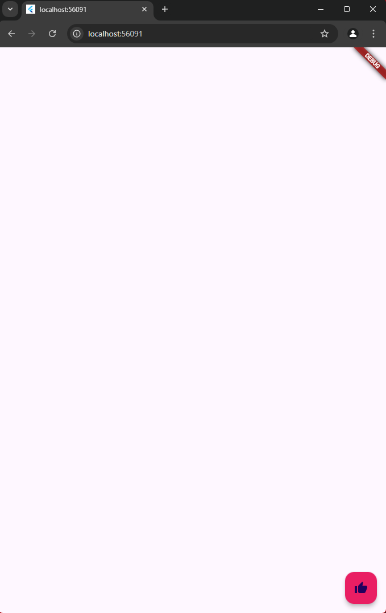
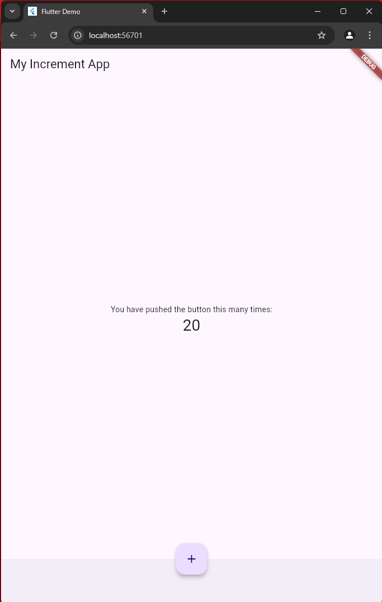
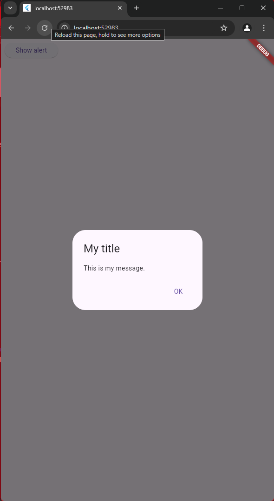
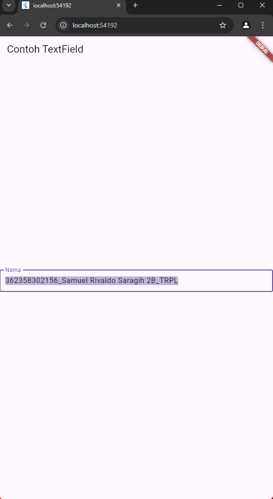
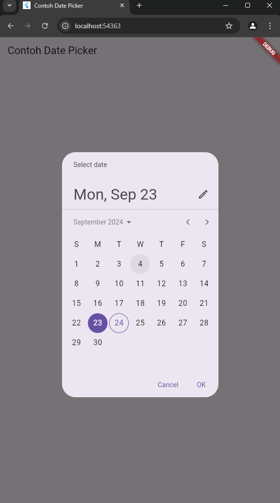

Praktikum 1
Gambar Praktikum 1 

Membuat file Project Baru

Praktikum 2
Gambar Praktikum 2

Membuat repository

Praktikum 3
Gambar Praktikum 3

Praktikum 4
Gambar Praktikum 4
Langkah 1: Cupertino Button dan Loading Bar
Buat file di basic_widgets > loading_cupertino.dart. Import stateless widget dari material dan cupertino. Lalu isi kode di dalam method Widget build adalah sebagai berikut.

langkah 2: Floating Action Button (FAB)
Button widget terdapat beberapa macam pada flutter yaitu ButtonBar, DropdownButton, TextButton, FloatingActionButton, IconButton, OutlineButton, PopupMenuButton, dan ElevatedButton.

Buat file di basic_widgets > fab_widget.dart. Import stateless widget dari material. Lalu isi kode di dalam method Widget build adalah sebagai berikut.

Langkah 3:Scaffold Widget
Scaffold widget digunakan untuk mengatur tata letak sesuai dengan material design.

Ubah isi kode main.dart seperti berikut.

Langkah 4: Dialog Wedget
Dialog widget pada flutter memiliki dua jenis dialog yaitu AlertDialog dan SimpleDialog

Langkah 5:Input dan Selection Widget
Flutter menyediakan widget yang dapat menerima input dari pengguna aplikasi yaitu antara lain Checkbox, Date and Time Pickers, Radio Button, Slider, Switch, TextField.

Langkah 6:Date and Time Pickers
Date and Time Pickers termasuk pada kategori input dan selection widget, berikut adalah contoh penggunaan Date and Time Pickers.

